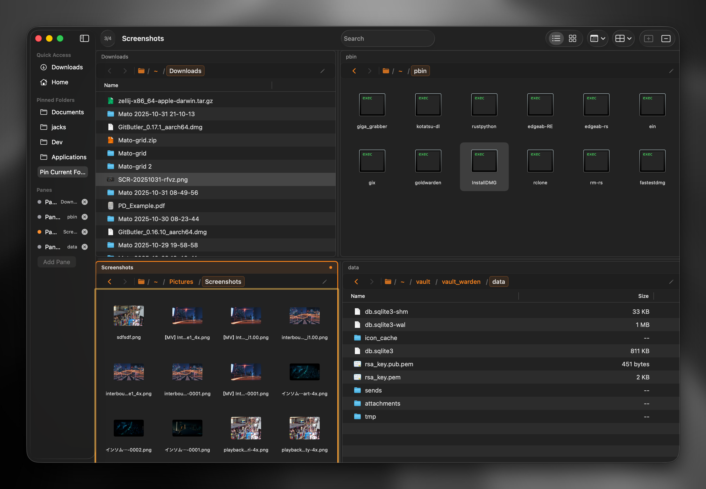
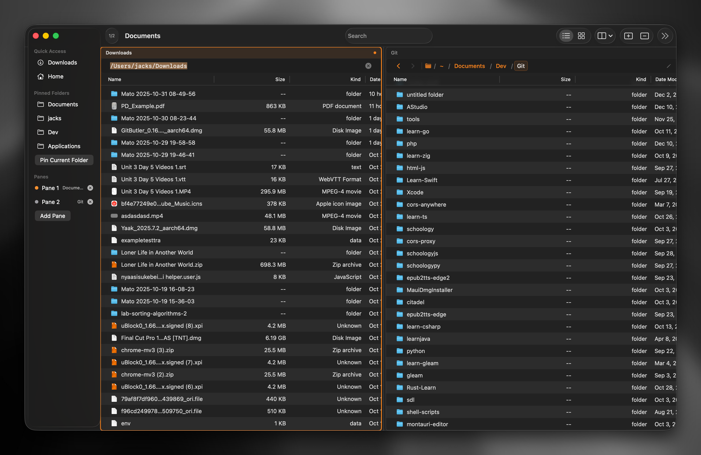

# Mato

A small, rough-around-the-edges macOS file manager that exists because I really, *really* don't like Finder.

## What is this?

This is what happens when weekend frustration meets SwiftUI curiosity. **mato** is a minimal file manager I built not because I had revolutionary ideas about file management, but because using Finder makes me want to throw my laptop out the window.

It's a sketch of a file manager — functional enough to browse files without wanting to scream, rough enough that you'll definitely find bugs, and honest enough to admit it's not going anywhere special.

## What it does

- **Multi-pane browsing** (1-4 panes, because tabs are for websites)
- **Smart address bar** with editable path and breadcrumb navigation
- **Dual view modes**: Grid view with thumbnails or detailed table view
- **Sidebar navigation** with quick access, pinned folders, and pane switching
- **File operations**: Copy, move, rename, delete, create new folders
- **Media playback**: Built-in audio/video player for quick previews
- **QuickLook integration**: Space bar to preview files
- **Drag & drop support**: Move files between panes or to folders
- **Directory watching**: Auto-refresh when files change
- **Thumbnail generation**: Visual previews for images and documents
- **Customizable settings**: Default folder, pane count, sort methods
- **Keyboard navigation**: Back/forward history, focus management
- **Clean, minimal interface** (mostly because I ran out of weekend)
- **Light and dark mode** support
- Exists as an alternative to Finder (the bar was not high)

## What it doesn't do

- Handle file system events gracefully
- Scale beyond "works on my machine"
- Have a roadmap, vision, or sustainable future
- Pretend to be production-ready
- Make you coffee (yet)

## Why does this exist?

Because sometimes you build things not to solve the world's problems, but to solve the very specific problem of "I hate the default file manager and have too much time on weekends."

This isn't a Finder killer — it's more like Finder's weird cousin who shows up uninvited but is surprisingly decent company.

## Should you use this?

¯\\_(ツ)_/¯

If you're the kind of person who:
- Enjoys tinkering with rough-around-the-edges software
- Also has strong feelings about Finder
- Appreciates honest mediocrity over polished disappointment
- Has realistic expectations about weekend projects

Then sure, give it a spin. Just don't expect miracles.

## Installation

1. Clone this repo
2. Open in Xcode
3. Build and run
4. Lower your expectations
5. Enjoy (or don't, that's fine too)

## Contributing

I'm not really maintaining this in any serious way, but if you find it useful and want to fix something or add a feature, feel free to open a PR. I can't promise I'll be responsive, but I can promise I'll be grateful.

## License

MIT — because even questionable weekend projects deserve to be free.

---

*Built with SwiftUI, weekend energy, and a disproportionate amount of Finder-related anger.*
